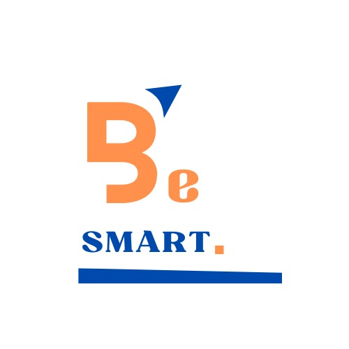

  

# Be Smart Pilotage

Logiciel de pilotage financier SaaS pour TPE/PME (Afrique de l'Ouest francophone), développé par Be Smart (Ouagadougou). Transformation d'un classeur Excel interne en application multi-tenant.

Stack : Next.js (TypeScript strict) + Supabase (PostgreSQL, RLS) + Vercel + PWA offline (Serwist/Dexie). Développement 100% local et gratuit (Supabase CLI/Docker) — voir `docs/00-decision-firebase-vs-supabase.md` pour le pourquoi de ce choix.

Deux principes non négociables sur ce projet : **sécurité de l'isolation multi-tenant** et **exactitude des calculs financiers**. Voir `CLAUDE.md` et `docs/` pour le cadrage complet avant toute implémentation.
