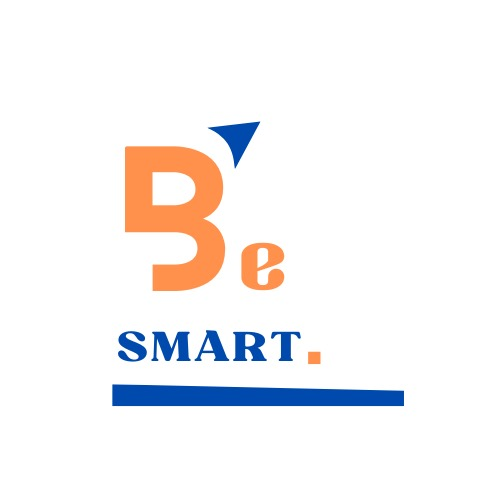

  

# Be Smart Pilotage

Logiciel de pilotage financier SaaS pour TPE/PME (Afrique de l'Ouest francophone), développé par Be Smart (Ouagadougou). Transformation d'un classeur Excel interne en application multi-tenant.

Stack : Next.js (TypeScript strict) + Supabase (PostgreSQL, RLS) + Vercel + PWA offline (Serwist/Dexie). Développement 100% local et gratuit (Supabase CLI/Docker) — voir `docs/00-decision-firebase-vs-supabase.md` pour le pourquoi de ce choix.

Deux principes non négociables sur ce projet : **sécurité de l'isolation multi-tenant** et **exactitude des calculs financiers**. Voir `CLAUDE.md` et `docs/` pour le cadrage complet avant toute implémentation.

## Version du CLI Supabase

Version épinglée : **2.120.0**, identique en local et en CI (`supabase/setup-cli` dans `.github/workflows/ci.yml`). Vérifier avec `supabase --version` ; en cas d'écart, mettre à niveau le CLI local (`brew upgrade supabase/tap/supabase`) puis `supabase stop --no-backup && supabase start`. Toute montée de version se fait en changeant les deux endroits dans la même PR : l'image Postgres embarquée et ses privilèges par défaut varient d'une version à l'autre.
